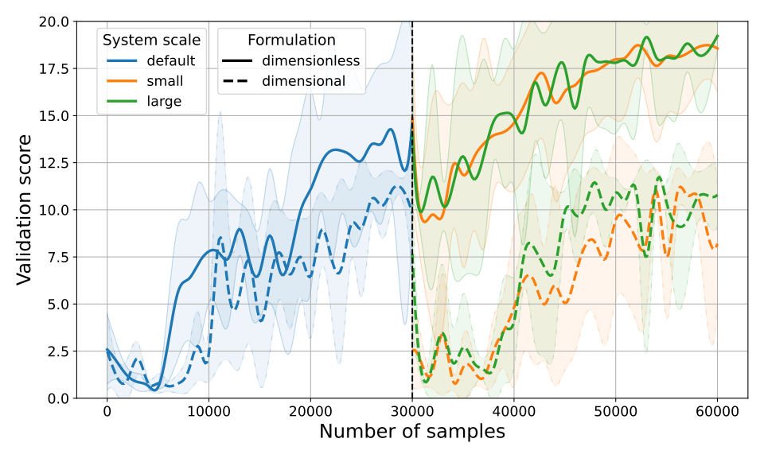

## Exploiting Dynamic Similarity for Direct Transfer of MPC-based Policies

### Introduction

This repository is associated with our paper on dimensionless Markov decision processes and learning-based MPC (the submitted manuscript is available on [arXiv](https://arxiv.org/abs/2512.08667), final version to appear at ECC26). In the paper, we propose leveraging dimensional analysis to identify similar systems and decision-making problems, which can be jointly solved using a dimensionless (i.e., normalized or scale-invariant) policy formulation. The method is demonstrated using reinforcement learning (RL) or Bayesian optimization (BO) to tune the parameters of a nonlinear MPC controller for closed-loop performance.

Cart pole example             |  Race car example
:-------------------------:|:-------------------------:
  |  

### Usage

The implementation of the cart pole example is based on [`leap-c`](https://leap-c.github.io/leap-c/) (and its dependencies), an open-source framework for implementing, among others, MPC-based RL algorithms. To run the example, please install `leap-c` and its dependencies according to [the instructions](https://leap-c.github.io/leap-c/installation.html).

NOTE: make sure you use the version referenced in `external/leap-c`.

The race car example is implemented using [`acados`](https://docs.acados.org/) and Optuna (v.4.5.0), which can be installed using the [`acados` installation instructions](https://docs.acados.org/python_interface/index.html#installation), followed by:

```bash
pip install optuna==4.5.0
```

NOTE: the example was tested with `acados` version referenced in `external/leap-c/external/acados`.

There might be some additional minor dependencies required to run the examples on your machine, but handling these should be straightforward.

### Funding

This work was supported in part by the [Croatian Science Foundation](https://hrzz.hr/en/) under the project "PVDC - Predictive vehicle dynamics control", UIP-2019-04-6487, and the European union through NextGenerationEU.
